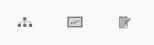
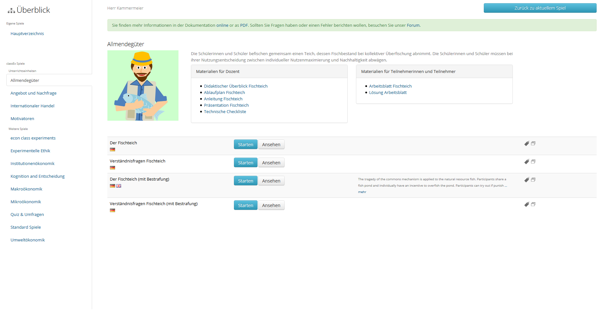
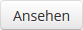
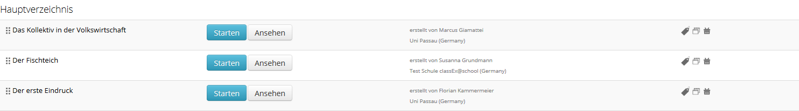

===========
LehrerInnen
===========

Hier bekommen Sie einen kurzen Überblick über die Möglichkeiten, die Ihnen als LehrerIn in classEx zur Verfügung stehen. Detailliertere Informationen finden Sie auf den Folgeseiten. 

.. raw:: html

    

    <iframe width="100%" height="350" src="https://www.youtube.com/embed/wvTQYDS6PPc" frameborder="0" allow="autoplay; encrypted-media" allowfullscreen></iframe>
    

.. raw:: latex

    Sie finden ein kurzes Einführungsvideo unter \url{https://www.youtu.be/wvTQYDS6PPc}.

Hauptansichten von classEx@school
=================================

In der rechten oberen Ecke finden Sie eine Navigationsleiste, die in jedem Modus angezeigt bleibt. Hier können Sie zwischen den Hauptansichten von classEx@school (Vorlesungsmodus, Überblick, Bearbeitungsmodus) wechseln und rechts daneben Ihre Benutzerdaten einsehen. 

Wenn Sie einen Modus ausgewählt haben, wird dieser dunkel schattiert angezeigt. Über das linke Symbol gelangen Sie in den Überblicksmodus. Das mittlere Symbol führt in den Vorlesungsmodus, das rechte in den Bearbeitungsmodus. Indem Sie auf den Namen Ihres Accounts klicken, der rechts neben der Modus-Leiste angezeigt wird, öffnen Sie ein Dropdown-Menü. Hier können Sie Ihre eigenen Daten, die Kursdaten, die Dokumentation, die Nutzungsbendingungen und einige allgemeine Informationen über classEx@school einsehen sowie sich selbst ausloggen. Sie können hier auch alle aktuell in Ihrem Kurs angemeldeten Teilnehmer ausloggen und das Kurspasswort ändern (beides über --> Kurs). 

Überblick
~~~~~~~~~

Hier finden Sie eine Übersicht all Ihrer Spiele und der standardmäßig implementierten Spiele. Sie können ein neues Spiel erstellen, indem Sie auf "Neues Spiel" in der oberen Menüleiste klicken. Die Spiele sind in Verzeichnissen, z. B. für verschiedene Unterrichtskapitel, abgelegt. Sie finden diese auf der linken Seite des Bildschirms. Sie können ein neues Verzeichnis erstellen indem Sie auf "Neues Verzeichnis" klicken. Verzeichnisse können umbenannt werden, indem man einen neuen Namen in dem Feld über der Liste der Spiele des Verzeichnisses eingibt. Sie können Spiele per Drag-and-Drop von einem Verzeichnis in ein anderes schieben.

Wenn Sie Spiel zu einem Verzeichnis hinzufügen möchten, die andere Spieler erstellt haben und die Sie nicht in den classEx-Spielen im Überblicksmodus finden können, klicken Sie in der oberen Menüleiste auf "Repository". Über das "Plus"-Zeichen können Sie alle öffentlich verfügbaren Spiele in Ihre Verzeichnisse importieren.

Über den Knopf |pic_starten| können Sie direkt in den Vorlesungsmodus wechseln, um ein Spiel zu starten. Über den Knopf |pic_ansehen| gelangen Sie in den Bearbeitungsmodus. Spiele, die von anderen Nutzern erstellt wurden, können nicht bearbeitet, sondern nur angesehen oder gespielt werden. Wenn Sie ein fremdes Spiel ändern möchten, können Sie eine Kopie davon in einem Ihrer Verzeichnisse anlegen. Dazu können Sie rechts neben dem Spiel auf |pic_copy| klicken. Im folgenden Bildschirm können Sie Name, Sprache und Verfügbarkeit des Spieles auswählen sowie Keywords, Kommentare und Literatur-Referenzen dazu angeben, die es anderen NutzerInnen erleichtern Ihr Spiel ebenfalls zu verwenden (sofern es als "Öffentlich" deklariert ist).

Mit Drag-and-Drop können Sie die Reihenfolge der Spiele in ihren Verzeichnissen ändern. In eigenen Verzeichnissen werden rechts neben den Spielen weitere Symbole angezeigt.

Durch Klicken auf das Mülleimer-Symbol |pic_Mülleimer| können Sie Spiele aus eigenen Verzeichnissen löschen. Das Symbol |pic_Schildchen| bedeutet, dass dieses Spiel von einem anderen Nutzer erstellt wurde und deswegen von Ihnen nicht bearbeitet werden kann. Wenn Sie ein Spiel selbst erstellt haben, können Sie außerdem über ein eigenes Symbol einstellen, ob es öffentlich verfügbar ist. Ein Box-Symbol zeigt, ob ein Spiel öffentlich ist |pic_öffentlich|, d. h. andere Nutzer können dieses Spiel sehen und kopieren, oder ob es privat ist |pic_privat|. Indem Sie auf das Symbol klicken können Sie diese Einstellung ändern. Über "Repository" in der oberen Menüleiste erhalten Sie Zugang zu allen öffentlichen Spielen, die von Ihnen oder anderen Nutzern erstellt wurden.

Vorlesungsmodus
~~~~~~~~~~~~~~~

Im Vorlesungsmodus führen Sie Spiele während des Unterrichts und zu Testzwecken durch. Mehr dazu erfahren Sie im folgenden Kapitel :ref:`Vorlesungsmodus`.

Bearbeitungsmodus
~~~~~~~~~~~~~~~~~

Im Bearbeitungsmodus können Sie bestehende Spiele bearbeiten und neue Spiele entwerfen. Die Dokumentation hierzu ist nur in englischer Sprache vorhanden. Sie können diese `hier`_ finden.

.. _hier: https://classex-doc.readthedocs.io/en/latest/

Unterrichtseinheiten
====================

Zu einzelnen Spielen aus ClassEx@school gibt es ausgearbeitete Unterrichtseinheiten mit Anleitungen, Übungsblättern und Präsentationen. Sie finden diese auf der classEx homepage im Bereich `Unterrichtseinheiten`_.

.. _Unterrichtseinheiten: https://classex.de/unterrichtseinheiten/
