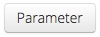

===============
Vorlesungsmodus
===============

In folgendem Video bekommen Sie eine kurze Einführung zur Durchführung eines Spiels in classEx@school. Detailliertere Informationen über alle Möglichkeiten, die Ihnen der Vorlesungsmodus bietet, finden Sie weiter unten.

.. raw:: html

    

    

    <iframe width="100%" height="350" src="https://www.youtube.com/watch?v=avR7y4X_p3k" frameborder="0" allow="autoplay; encrypted-media" allowfullscreen></iframe>
    

.. raw:: latex

    Sie finden ein kurzes Einführungsvideo unter \url{https://www.youtube.com/watch?v=avR7y4X_p3k}.

Kontrolleiste
=============

Die Kontrollleiste des Vorlesungsmodus sieht folgendermaßen aus: 

..image:: _static/UM_KL1_school.jpg
    :alt:  300px

Sie finden hier folgende Symbole:

- Spiel auswählen: Hier finden Sie alle Spiele aus Ihren persönlichen und den allgemeinen Verzeichnissen. Sobald Sie auf ein Spiel klicken, wird es geöffnet.

- QR Code Symbol: Wenn Sie auf dieses Symbol klicken, wird der QR Code vergrößert angezeigt. Dazu werden Instruktionen angezeigt wie sich TeilnehmerInnen ohne Nutzung des QR Codes einloggen können.

- ..image::_static/testpart.JPG
    :alt:  80px
Klicken Sie auf dieses Symbol um in einem neuen Tab einen zusätzlichen Testteilnehmer hinzuzufügen. Dies kann beim Testen von classEx-Spielen sehr hilfreich sein. Wenn Sie die Steuerungstaste gedrückt halten, können Sie mehrere Testteilnehmer am Stück hinzufügen.

- ..image::_static/steto.png 
    :alt:  80px

Klicken Sie auf dieses Symbol um in den Diagnosemodus zu gelangen. Hier sehen Sie eine Übersicht aller Spielvariablen und können so Programmierfehler leichter entdecken.

- Daten: Drop down Menu. Klicken Sie auf Daten anzeigen um eine Teilnehmertabelle zu öffnen, die Ihnen eine Übersicht über alle Teilnehmer und deren aktuelle Stage gibt. "Zurück zum Vorlesungsmodus" bringt Sie zurück zum aktuellen Spiel. 

..image:: _/static/daten anzeigen.png
    :alt:  300px
- Als Excel-Datei herunterladen: Im Drop down Menu Daten können Sie auch Excel-Dateien herunterladen. Diese enthalten die Entscheidungen eines soeben gespielten Spiels. Es sind auch Dateien verfügbar, die eine Übersicht der in diesem Spiel existierenden Rollen, Treatments und Gruppen und die Teilnehmer IDs und Loginzeiten enthalten. 

..image:: _/static/daten herunterladen.png
    :alt:  300px

Rechts neben dem Daten-Menu finden Sie in vielen Spielen außerdem ein Menu in dem Sie die Ergebnisse vorheriger Spiele von Ihnen oder anderen Experimentatoren ansehen können.

Testen eines Spiels
===================

Bevor Sie ein Spiel im Unterricht durchführen, können Sie es durch Klicken auf |pic_testparticipant| in der Kontrollleiste testen. Es öffnet sich ein Teilnehmerfenster in einem neuen Tab. Darin wird das Spiel genau so angezeigt, wie die TeilnehmerInnen im Unterricht es auf Ihren mobilen Geräten sehen. Sie können so viele Fenster öffnen wie Sie wollen. Damit können Sie auch die Interaktion von TeilnehmerInnen in verschiedenen Rollen simulieren.

Starten eines Spiels
====================

Während des Unterrichts geschieht die Interaktion zwischen LehrerIn und SchülerInnen über den Vorlesungsmodus. Der Bildschirm des Lehrers/der Lehrerin wird üblicherweise für alle TeilnehmerInnen sichtbar auf eine Wand projiziert. Spiele werden im Vorlesungsmodus gestartet und beendet und Ergebnisse werden auch in diesem Modus angezeigt. LehrerInnen können ein Spiel auswählen und starten.

LehrerInnen können ein neues Spiel auswählen indem sie es aus der Drop down Liste auswählen. Diese Liste enthält alle verfügbaren Spiele. Ein ausgewähltes Spiel kann durch Drücken der Taste "Starten" gestartet werden.

..image:: _/static/Spiel_starten.jpg
    :alt:  150px

Damit beginnt die erste Stage eines Spiels. Wenn ein Spiel aus mehreren Stages besteht, wird die Starttaste der nächsten Stage nach dem Drücken der Starttaste für die erste Stage angezeigt.

Der Zähler über der Starttaste zeigt wieviele Teilnehmer zurzeit eingeloggt sind. Es gibt keine Mindestanzahl an TeilnehmerInnen, die für das Starten eines Spiels erforderlich ist. Um ein Spiel erfolgreich durchzuführen, ist jedoch eine Mindestanzahl an TeilnehmerInnen erforderlich - etwa bei Spielen in Fünfer-Gruppen fünf TeilnehmerInnen. Steigt die Anzahl der Treatments, nimmt auch die Zahl der erforderlichen TeilnehmerInnen zu.

.. note:: Wenn ein Spiel mehrere Treatments/Rollen enthält, werden die Teilnehmer den Treatments/Rollen alternierend zugeordnet. Wenn die Anzahl der Teilnehmer kein Vielfaches der Gruppengröße ist, kann der Programmparameter FindPartnerDecision (siehe Kapitel Elements in der classEx Documentation) mit einem Zufallsargument so eingestellt werden, dass niemand von der Teilnahme am Spiel ausgeschlossen wird. 

Während des Spiels
==================

Während des Durchlaufs einer Stage zeigt ein Display an wieviele Teilnehmer eingeloggt sind und wieviele von ihnen bereits ihre Entscheidung in der aktuellen Stage getroffen haben. 

..image:: _static/Ergebnis_anzeigen.jpg
    :alt:  150px

Hier sind drei Teilnehmer eingeloggt und einer hat bereits seine Entscheidung getroffen.

    Tipp: Wenn Sie mit einer großen Gruppe spielen kann es passieren, dass einzelne Teilnehmer längere Zeit brauchen bis sie ihre Entscheidung getroffen haben. Sie sollten ein wenig warten aber die Eingabephase beenden und weitermachen, wenn der Mehrwert durch zusätzliche Eingaben sehr klein wird.

Ein Spiel beenden
=================

Wenn die TeilnehmerInnen ihre Entscheidungen getroffen haben, kann das Spiel beendet werden, indem die Lehrerin oder der Lehrer auf "Ergebnisse anzeigen" klickt.

::image:: _/static/Erg_u_Gew_anzeigen.jpg
    :alt:  300px

Wenn Spiele um echtes Geld gespielt werden, steht neben der Taste "Ergebnisse anzeigen" auch die Taste "Ergebnisse und Auszahlungen anzeigen" zur Verfügung. Sollten Sie keine Auszahlungen machen wollen (zum Beispiel in Proberunden) können Sie auch auf die Taste "Nur Ergebnisse anzeigen" klicken.

Parameter ändern
================

Sie können die Parameter eines Spiels ändern, indem Sie auf |pic_Parameter| klicken. Zum Beispiel können Sie in einem Public Goods-Spiel die MPRC, die Anfangsausstattung und die Rundenanzahl ändern und dann das Spiel mit den geänderten Parametern neu starten. Sie starten das Spiel neu indem Sie auf |pic_Neu_starten| klicken.

.. |pic_Neu_starten| image:: _static/Neu_starten.JPG
                            :width: 70px

Grafische Ergebnisse
====================

..image:: _static/Beautymacro.JPG
    :alt:  300px

Einige der angezeigten Abbildungen und Diagramme können adaptiert werden. Alle mit Highcharts.com (siehe untere rechte Ecke der Abbildung oben) gekennzeichneten Abbildungen haben eine Zoomfunktion. Sie können zoomen indem Sie einfach klicken und den Mauszeiger über den Bereich ziehen, in den Sie zoomen wollen. Die Taste "Zoom zurücksetzen" setzt die Anzeige wieder auf die Originalgröße zurück.

Bei Histogrammen können Sie die Einstellungen für Klassen und das Maximum durch Klicken auf das kleine Symbol in der unteren linken Ecke des Diagramms ändern. Sie geben einfach neue Werte in die entsprechenden Eingabefelder und klicken dann neben das Klassenfenster. Dies kann hilfreich sein wenn die Standardgröße der Klasse zu klein eingestellt ist (die Klassen werden dann für alle Graphen geändert).

In der oberen rechten Ecke des Graphen sehen Sie ein Symbol mit drei Linien. Wenn Sie darauf klicken, können Sie den Graphen in verschiedenen Bildformaten (jpeg, png, pdf, svg) herunterladen. Sie können den Graphen auch drucken.

Für mehr Informationen zu Graphen mit verschiedenen Ergebnissen `klicken Sie hier`_. 

.. _klicken Sie hier: https://classex-doc.readthedocs.io/en/latest/Elements.html#result-element
